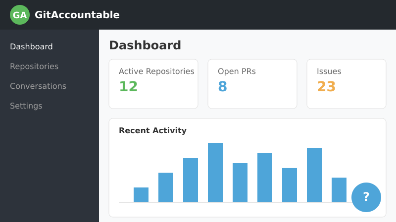

# GitAccountable

<div align="center">
  
  <h4>Track, Manage, and Maintain Your GitHub Repositories with AI Assistance</h4>


</div>

## 📱 Install as a PWA

GitAccountable is a Progressive Web App, which means you can install it on your desktop or mobile device for offline access. Click the install button in your browser's address bar to add it to your home screen or desktop.

<div align="center">
  
</div>

## ✨ Overview

GitAccountable is a comprehensive GitHub repository management tool that helps you track activity, maintain consistency, and ensure your projects stay active and healthy. With its conversational AI assistant, you'll receive smart insights and reminders tailored to your repositories.

## 🚀 Key Features

- **Intelligent Dashboard** - View repository health metrics, activity trends, and pending tasks in one place
- **Repository Status Tracking** - Automatically categorize repositories as active, stale, or inactive based on commit history
- **Smart Reminders** - Get notified about pending pull requests, issues, and inactive repositories
- **AI Assistant** - Chat with an AI assistant trained on your GitHub data to get repository-specific advice
- **Offline Support** - Full PWA functionality allows you to review data and set reminders even without internet access
- **Real-time GitHub Sync** - Changes in your GitHub repositories are reflected in GitAccountable

## 💻 Technology Stack

- **Frontend**: React 18, TypeScript, TailwindCSS, Shadcn UI Components
- **Backend**: Node.js, Express
- **API Integration**: GitHub API, OpenAI API
- **Storage**: In-memory storage with PostgreSQL compatibility
- **PWA Features**: Service workers, offline caching, push notifications, installable

## 🔧 Installation

### Prerequisites

- Node.js 20+ and npm
- GitHub Personal Access Token with repository permissions
- OpenAI API Key (optional, for AI assistant features)

### Quick Start

1. Clone the repository:
   ```bash
   git clone https://github.com/IgorGanapolsky/GitAccountable.git
   cd GitAccountable
   ```

2. Install dependencies:
   ```bash
   npm install
   ```

3. Set up environment variables in a `.env` file:
   ```
   GITHUB_TOKEN=your_github_personal_access_token
   OPENAI_API_KEY=your_openai_api_key  # Optional
   ```

4. Start the development server:
   ```bash
   npm run dev
   ```

5. Access the application at `http://localhost:5000`

## 📱 PWA Features

GitAccountable is designed as a Progressive Web App (PWA) with the following features:

- **Offline Access** - View your repository data even without an internet connection
- **Installable** - Add to your home screen for quick access
- **Push Notifications** - Get alerted about repository activity and reminders
- **Responsive Design** - Optimized for both desktop and mobile devices
- **Background Sync** - Updates happen automatically when connectivity is restored

## 🧠 AI Assistant Capabilities

The built-in AI assistant can help with:

- Analyzing repository health and suggesting improvements
- Providing context for inactive repositories
- Suggesting prioritization of pending issues and PRs
- Crafting commit messages and PR descriptions
- Explaining complex code patterns found in your repositories

## 📖 Usage Guide

- **Dashboard**: Access overall statistics, recent activities, and upcoming reminders
- **Repositories**: Browse all your GitHub repositories with status indicators and health metrics
- **Conversations**: Review previous interactions with the AI assistant
- **Settings**: Configure your GitHub credentials and notification preferences

## 🛠️ Development

### Project Structure

```
GitAccountable/
├── client/            # React frontend
├── server/            # Express backend
├── shared/            # Shared types and utilities
├── public/            # Public assets and PWA files
└── scripts/           # Build and utility scripts
```

### Available Scripts

- `npm run dev` - Start development server
- `npm run build` - Build production-ready frontend and backend
- `npm start` - Run the production build
- `npm test` - Run tests

## 👥 Contributing

Contributions are welcome! Please feel free to submit a Pull Request.

1. Fork the repository
2. Create your feature branch (`git checkout -b feature/amazing-feature`)
3. Commit your changes (`git commit -m 'Add some amazing feature'`)
4. Push to the branch (`git push origin feature/amazing-feature`)
5. Open a Pull Request

## 📄 License

This project is licensed under the MIT License - see the LICENSE file for details.
